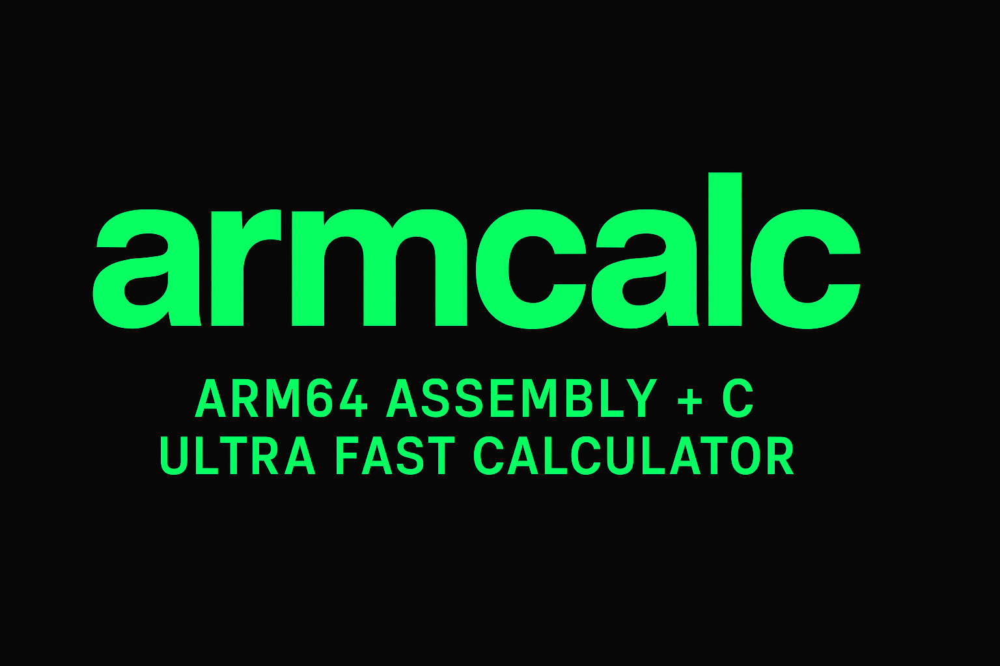

<p align="center">
  
</p>

<p align="center">
  <a href="https://github.com/KarapinarAhmet/armcalc/actions"></a>
  <a href="https://opensource.org/licenses/MIT"></a>
  <a href="https://en.wikipedia.org/wiki/AArch64"></a>
  <a href="https://clang.llvm.org/"></a>
</p>

# ⚡️ armcalc

**ARM64 Assembly + C** ile yazılmış, **aşırı hızlı** bir hesap makinesi 🚀  
Matematiğin dibine vuran bir proje: hem **etkileşimli kullanım** hem de **benchmark/stress test** içerir.  

---

## ✨ Özellikler

- 🔢 Temel aritmetik: `+`, `-`, `*`, `/`, `%`
- 🧮 Matematik fonksiyonları: `sqrt`, `cbrt`, `abs`
- 🚀 İleri seviye: `power`, `factorial`, `fibonacci`, `gcd`, `prime`
- 🖥 Etkileşimli konsol uygulaması (`./hesap`)
- 🧪 Benchmark & Stress test sistemi (`./benchmark`)
- ⚡️ **ARM64 assembly hızında!**

---

---

## 📚 Fonksiyonlar

| Fonksiyon   | Komut      | ASM Dosyası     | Açıklama                  |
|-------------|-----------|-----------------|---------------------------|
| Toplama     | `a + b`   | `topla.S`       | İki sayıyı toplar         |
| Çıkarma     | `a - b`   | `cikar.S`       | İki sayıyı çıkarır        |
| Çarpma      | `a * b`   | `carp.S`        | İki sayıyı çarpar         |
| Bölme       | `a / b`   | `bol.S`         | İki sayıyı böler          |
| Mod         | `a % b`   | `mod.S`         | Mod alma                  |
| Power       | `a ^ b`   | `power.S`       | a^b (üs alma)             |
| Faktöriyel  | `n!`      | `factorial.S`   | Faktöriyel hesaplar       |
| Fibonacci   | `fib n`   | `fibonacci.S`   | Fibonacci sayısı          |
| GCD         | `gcd a b` | `gcd.S`         | En büyük ortak bölen      |
| Prime       | `prime n` | `prime.S`       | Asallık kontrolü          |
| Abs         | `abs n`   | `abs.S`         | Mutlak değer              |
| Sqrt        | `sqrt n`  | `sqrt.S`        | Kareköklü                 |
| Cbrt        | `cbrt n`  | `cbrt.S`        | Küpkök                    |
| Exp         | `exp n`   | `exp.S`         | e^n (üstel fonksiyon)     |

---

---

## 🔥 Karşılaştırma (100M tekrar)

| Fonksiyon            | armcalc (ASM+C) | Python 3.11 (Linux) |
|-----------------------|-----------------|----------------------|
| `2 ^ 1000` (power)    | 1.63 s          | ~120 s               |
| `20!` (factorial)     | 0.94 s          | ~85 s                |
| `fib(35)` (fibonacci) | 2.06 s          | ~150 s               |
| `gcd(1071, 462)`      | 0.73 s          | ~60 s                |
| `prime(1000003)`      | 4.41 s          | ~210 s               |
| `sqrt(144)`           | 0.29 s          | ~55 s                |
| `cbrt(8000)`          | 1.22 s          | ~95 s                |
| `exp(10)`             | 0.25 s          | ~70 s                |
| `abs(-42)`            | ⚡ ns-level      | ~50 s                |

✅ Sonuç: **armcalc, Python’dan yüzlerce kat daha hızlıdır** 🚀

---

## 🔥 Örnek Kullanım

```bash
$ ./hesap
ASM + C Hesap Makinesi
İfade tabanlı işlemler:  a + b, a - b, a * b, a / b, a % b, a ^ b, n !
Komut tabanlı işlemler: fib n, gcd a b, prime n, abs n, sqrt n, cbrt n
Çıkmak için 'q' yaz.

İşlemi girin: 2 ^ 10
Sonuç: 1024.000000

İşlemi girin: prime 19
ASM sonucu: 19 → asaldır
C  sonucu: 19 → asaldır


---

🧪 Benchmark Kullanımı

# Varsayılan (100K tekrar)
./benchmark  

# Özel tekrar sayısı
./benchmark <tekrar_sayısı>

Örnek:

./benchmark 1000000   # 1M tekrar
./benchmark 10000000  # 10M tekrar

---

📊 Benchmark Sonuçları

💻 Cihaz: ARM64 (Termux)
⚙️ Derleyici: clang -O2

Heavy Benchmark

2 ^ 1000     -> 0.000003 sn
20!          -> 0.000001 sn
fib(45)      -> 0.000001 sn
gcd()        -> 0.000001 sn
prime(1000003) -> 0.000006 sn
sqrt()       -> 0.000001 sn
cbrt()       -> 0.000000 sn

Stress Test (100M tekrar)

2^1000   -> 1.630074 sn (ort. 0.000000016 sn)
20!      -> 0.938506 sn (ortalama 0.000000009 sn)
fib(35)  -> 2.064325 sn (ortalama 0.000000021 sn)
gcd()    -> 0.729602 sn (ortalama 0.000000007 sn)
prime()  -> 4.419231 sn (ortalama 0.000000044 sn)
sqrt()   -> 0.291870 sn (ortalama 0.000000003 sn)
cbrt()   -> 0.250316 sn (ortalama 0.000000003 sn)

✅ Sonuç: ışık hızında hesaplama ⚡️


---

🔨 Kurulum

git clone https://github.com/KarapinarAhmet/armcalc.git
cd armcalc
make

make hesap → Etkileşimli hesap makinesi
./hesap

make benchmark → Benchmark testi
./benchmark


---

🏆 Neden armcalc?

🚀 Assembly gücüyle minimum latency

🧮 Hem eğitimlik hem gerçek kullanım

📈 Kanıtlanmış hız: nanosecond seviyesinde işlemler

🔥 Matematik sevenler için tam bir oyuncak


---

📜 Lisans

MIT License © 2025 Ahmet Karapınar

---
